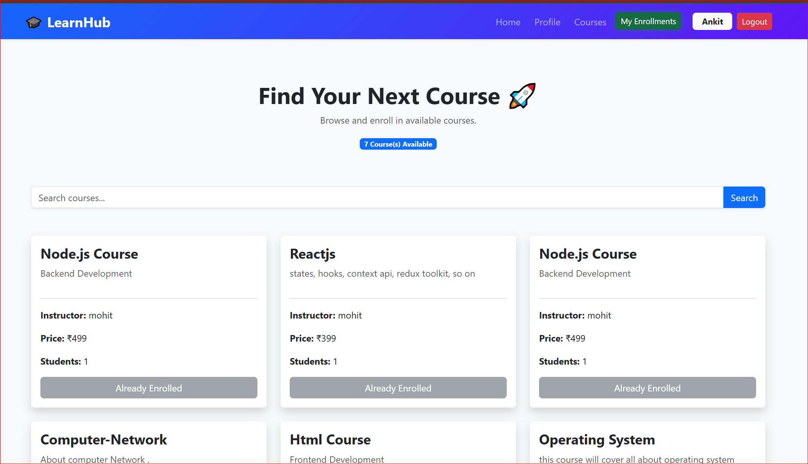

# 🎓 Online Learning Platform

A full-stack Online Learning Platform built using the MERN Stack (MongoDB, Express.js, React.js, Node.js). The platform allows instructors to create and manage courses while students can browse, search, enroll, and access courses.

## 🚀 Live Demo

**Frontend:** [https://online-learning-plateform-frontend-qvhf7ex9q.vercel.app/](https://online-learning-plateform-frontend-xi.vercel.app/)

**Backend API:** https://online-learning-plateform-backend-api.onrender.com/

---

# 📌 Project Overview

This project simulates a real-world online learning system where two types of users interact:

### 👨‍🏫 Instructor

* Register as an Instructor
* Login securely
* Create new courses
* View created courses
* Manage course content

### 👨‍🎓 Student

* Register as a Student
* Login securely
* Search available courses
* Enroll in courses
* View enrolled courses

The project demonstrates authentication, authorization, course management, enrollment workflows, API development, database relationships, and deployment.

---

# ✨ Features

## Authentication & Authorization

* User Registration
* User Login
* JWT Authentication
* Cookie-Based Authentication
* Protected Routes
* Role-Based Access Control

## Student Features

* Search Courses
* View Course Details
* Enroll in Courses
* View Enrolled Courses

## Instructor Features

* Create New Courses
* View Created Courses
* Manage Course Listings

## System Features

* Responsive UI
* RESTful API Architecture
* MongoDB Database Integration
* Secure Password Hashing with Bcrypt
* Environment Variables
* Deployment Ready

---

# 🛠 Tech Stack

## Frontend

* React.js
* React Router DOM
* Axios
* Bootstrap 5

## Backend

* Node.js
* Express.js
* JWT Authentication
* Cookie Parser
* Bcrypt
* Joi Validation

## Database

* MongoDB Atlas
* Mongoose ODM

## Deployment

* Vercel (Frontend)
* Render (Backend)

---

# 🔐 Authentication Flow

1. User registers as Student or Instructor.
2. Password is hashed using Bcrypt.
3. User logs in.
4. JWT Token is generated.
5. Token is stored in HTTP-Only Cookies.
6. Protected routes verify JWT.
7. Authorized users access resources based on roles.

---

# 📸 Project Screenshots

## Home Page


## Register Page


## Courses Page


## Enroll Course Page



---

# ⚙️ Installation & Setup

## Clone Repository

```bash
git https://github.com/ANKIT-MANDLOI-17/Online-Learning-Plateform-Frontend.git
```

## Frontend Setup

```bash
cd client

npm install

npm start
```

Runs on:

```bash
http://localhost:3000
```

## Backend Setup

```bash
cd server

npm install

npm start
```

Runs on:

```bash
http://localhost:8080
```

---

# 🔑 Environment Variables

Create a `.env` file inside the server directory.

```env
DB_URL=your_mongodb_connection_string

PASSPORT_SECRET=your_secret_key
```

---

# 🧪 API Endpoints

## Authentication

```http
POST /api/user/register
```

```http
POST /api/user/login
```

```http
POST /api/user/logout
```

## Courses

```http
GET /api/courses
```

```http
POST /api/courses
```

```http
GET /api/courses/instructor/:id
```

```http
GET /api/courses/student/:id
```

```http
POST /api/courses/enroll/:id
```

---

# 💡 Challenges Solved

* JWT Authentication
* Cookie-Based Login
* Role-Based Authorization
* MongoDB Relationships
* Course Enrollment Logic
* Protected Routes
* Cross-Origin Requests (CORS)
* Deployment on Vercel & Render

---

# 🚀 Future Enhancements

* Course Videos
* File Uploads
* Payment Gateway Integration
* Email Verification
* Password Reset
* User Dashboard Analytics
* Ratings & Reviews
* Wishlist
* Course Progress Tracking
* Certificates Generation
* Admin Panel
* Live Classes

---

# 📈 Learning Outcomes

Through this project, I gained hands-on experience with:

* React.js Development
* Express.js APIs
* MongoDB & Mongoose
* Authentication & Authorization
* JWT & Cookies
* REST API Design
* Full Stack Application Architecture
* Deployment & Production Configuration

---

# 👨‍💻 Author

**Ankit Mandloi**

Frontend Developer | MERN Stack Developer

GitHub: https://github.com/ANKIT-MANDLOI-17

LinkedIn: https://www.linkedin.com/in/ankit-mandloi-8203a9251/

